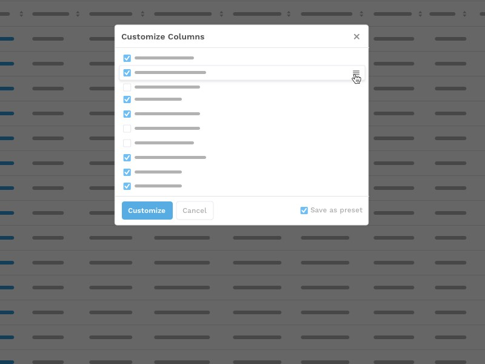

# \<sacs-select-fields\>

Necesito tomar la decisión de que campos deseo ver en la vista principal del data table, para poder ver mi informacion en las diferentes secciones de manera efectiva.

## Criterios de aceptación

- Poder hacer dragndrop para determinar su posicion en el data table 
- Poder con un simple check habilitar el campo para la vista o deshabilitarlo
- Poder guardarlo
- Experiencia simple. 

## Example




## Install the Polymer-CLI

First, make sure you have the [Polymer CLI](https://www.npmjs.com/package/polymer-cli) installed. Then run `polymer serve` to serve your element locally.

## Install component

```
bower i --save sacscloud/sacs-select-fields
```

## Viewing Your Element

```
$ polymer serve
```

## Test of component

The component must have the test basic:

- The component exist
- The component is in the DOM

The component must have test for properties:

- The property exist
- The property is declareded
- The property not is undefined

The component must have test for functions:

- The function is declareded
- The function exist
- The function don't throw error

### Running Tests

```
$ polymer test
```

Your application is already set up to be tested via [web-component-tester](https://github.com/Polymer/web-component-tester). Run `polymer test` to run your application's test suite locally.


## Properties

Las propiedades descritas solo son la base pero se deben agregar todas las que sean necesarias.

Name | Type | Description | Default
-----|-------------|---------|--------
`example` | `Array` | array to data | `[]`


## Methods

Las metodos descritos solo son la base pero se deben agregar todos las que sean necesarios.

Method | Description | Parameters | Return
-----|-------------|---------|------------
`example` | description | param | no retorna nada


## Events

Este componente no lanza ningun evento.

## Dependencies

Este componente no usa dependencias de otros componentes

## Use

```
<sacs-select-fields></sacs-select-fields>
```

## Behaviour

Descripcion del comportamiento interno del componente.

## Styling

Las siguientes propiedades y mixins estan disponibles para styling.

Custom property | Description | Default
----------------|-------------|----------
`--sacs-select-fields-color` | background color | `#fff`

## Versions

El componente debe ser tageado para cada nuevo commit:

```
git tag v1.0.0
```
y se debe subir al repositorio

```
git push origin master v1.0.0
```

La version en el bower json tambien debe ser actualizada